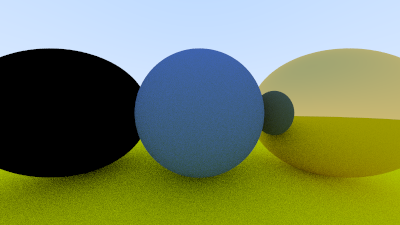

#  Notes

[Ray Tracing in One Weekend](https://raytracing.github.io/books/RayTracingInOneWeekend.html)

Need to:
- add documentation to functions (particularly the math)
- run autoformatter

Currently at: https://raytracing.github.io/books/RayTracingInOneWeekend.html#metal

something is broken between 10 through 10.33
--> moving on to see if it gets fixed

Now at 11, but still broken

